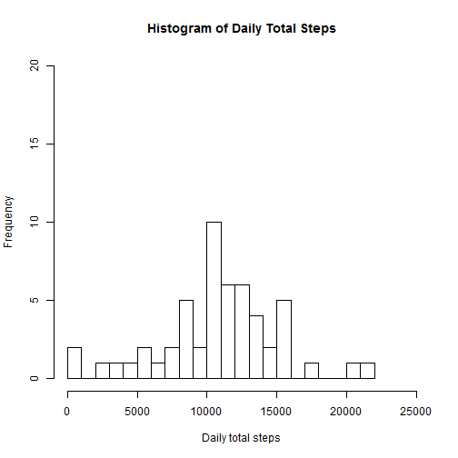
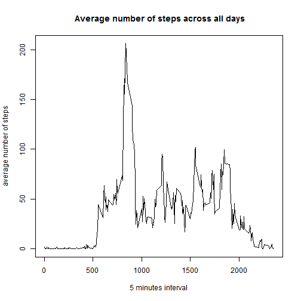
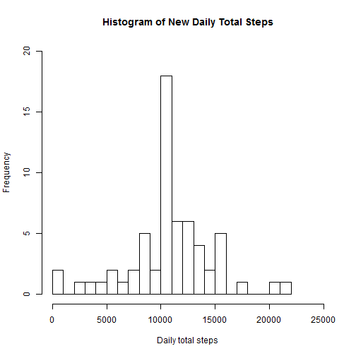
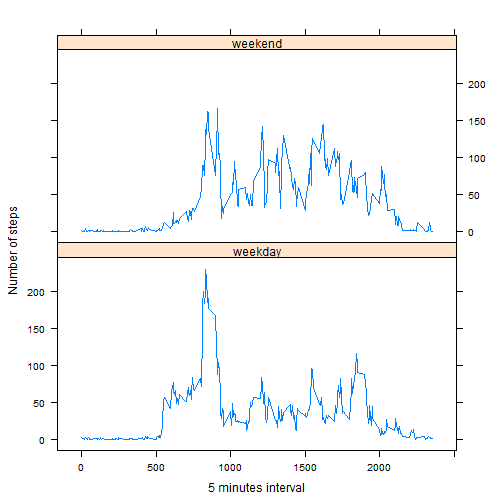

## Introduction:
This assignment makes use of data from a personal activity monitoring device. This device collects data at 5 minute intervals through out the day. The data consists of two months of data from an anonymous individual collected during the months of October and November, 2012 and include the number of steps taken in 5 minute intervals each day.

## Data:
The data for this assignment can be downloaded from the course web site:
Dataset: Activity monitoring data [52K]
The variables included in this dataset are:

* steps: Number of steps taking in a 5-minute interval (missing values are coded as NA)

* date: The date on which the measurement was taken in YYYY-MM-DD format

* interval: Identifier for the 5-minute interval in which measurement was taken

The dataset is stored in a comma-separated-value (CSV) file and there are a total of 17,568 observations in this dataset.


****Please make sure your cvs file is in your working directory.

## Loading and preprocessing the data

```r
activity <- read.csv(file = "activity.csv", head = TRUE, stringsAsFactors = FALSE)
dim(activity)
```

```
## [1] 17568     3
```

```r
str(activity)
```

```
## 'data.frame':	17568 obs. of  3 variables:
##  $ steps   : int  NA NA NA NA NA NA NA NA NA NA ...
##  $ date    : chr  "2012-10-01" "2012-10-01" "2012-10-01" "2012-10-01" ...
##  $ interval: int  0 5 10 15 20 25 30 35 40 45 ...
```
Remove all the cases have NAs

```r
act_comp <- activity[complete.cases(activity), ]
```
## What is mean total number of steps taken per day?


```r
wd <- aggregate(steps ~ date, act_comp, sum)
#histogram
hist(wd$steps, xlab = "Daily total steps", main = "Histogram of Daily Total Steps", 
     xlim = c(0, 25000), ylim = c(0, 20), breaks = 20)
```

 

```r
#get the mean and median of daily total steps.
cat("Daily total steps mean:")
```

```
## Daily total steps mean:
```

```r
mean(wd$steps)
```

```
## [1] 10766
```

```r
cat("Daily total steps median:")
```

```
## Daily total steps median:
```

```r
median(wd$steps)
```

```
## [1] 10765
```


## What is the average daily activity pattern?
Make a time series plot (i.e. type = "l") of the 5-minute interval (x-axis) and the average number of steps taken, averaged across all days (y-axis)

```r
intvl <- aggregate(steps ~ interval, act_comp, mean)
plot(intvl$interval, intvl$steps, xlab = "5 minutes interval", 
     ylab = "average number of steps",
     main = " Average number of steps across all days", type = "l")
```

 

```r
#which 5 minute interval, on average across all the days in the dataset,
#has the max number of steps?
intvl[intvl$steps == max(intvl$steps),]
```

```
##     interval steps
## 104      835 206.2
```


## Imputing missing values
Note that there are a number of days/intervals where there are missing values (coded as NA). The presence of missing days may introduce bias into some calculations or summaries of the data.

```r
# Calculate and report the total number of missing values in the dataset
ok <- complete.cases(activity$steps)
cat("Total number of missing values (NAs) in dataset:")
```

```
## Total number of missing values (NAs) in dataset:
```

```r
sum(!ok) #count how many NAs
```

```
## [1] 2304
```
Using mean value of 5 minutes intervals to replace correspondent NAs of steps.


```r
#Change interval steps names of dataset intvl.
names(intvl) <- c("interval", "mean_steps")
#Build a new interval-mean data frame repeat 61 times, int_mst
#Will have same row number as original set.
int_mst <- rep(intvl, times = 61)

#merge datasets activity with int_mst
total_act <- cbind(activity, int_mst$mean_steps)
#Give the new names to variables.
names(total_act) <- c("steps", "date", "interval", "int_mean_steps")
str(total_act)
```

```
## 'data.frame':	17568 obs. of  4 variables:
##  $ steps         : int  NA NA NA NA NA NA NA NA NA NA ...
##  $ date          : chr  "2012-10-01" "2012-10-01" "2012-10-01" "2012-10-01" ...
##  $ interval      : int  0 5 10 15 20 25 30 35 40 45 ...
##  $ int_mean_steps: num  1.717 0.3396 0.1321 0.1509 0.0755 ...
```

```r
#replace NAs with correspondent interval mean_steps.
newd <- total_act
newd$steps[is.na(newd$steps)] <- newd$int_mean_steps
```

```
## Warning: number of items to replace is not a multiple of replacement
## length
```

```r
#check if NAs are all replaced.
w1 <- complete.cases(newd$steps)
cat("NAs in the new mean-step-replaced dataset")
```

```
## NAs in the new mean-step-replaced dataset
```

```r
sum(!w1)
```

```
## [1] 0
```

```r
str(newd)
```

```
## 'data.frame':	17568 obs. of  4 variables:
##  $ steps         : num  1.717 0.3396 0.1321 0.1509 0.0755 ...
##  $ date          : chr  "2012-10-01" "2012-10-01" "2012-10-01" "2012-10-01" ...
##  $ interval      : int  0 5 10 15 20 25 30 35 40 45 ...
##  $ int_mean_steps: num  1.717 0.3396 0.1321 0.1509 0.0755 ...
```

```r
#create new data set equivalent to the original with all NAs filled.
new_activity <- newd[, 1:3]
str(new_activity)
```

```
## 'data.frame':	17568 obs. of  3 variables:
##  $ steps   : num  1.717 0.3396 0.1321 0.1509 0.0755 ...
##  $ date    : chr  "2012-10-01" "2012-10-01" "2012-10-01" "2012-10-01" ...
##  $ interval: int  0 5 10 15 20 25 30 35 40 45 ...
```

```r
wdn <- aggregate(steps ~ date, new_activity, sum)
#Make a histogram of the total number of steps taken each day
hist(wdn$steps, xlab = "Daily total steps", main = "Histogram of New Daily Total Steps", 
     xlim = c(0, 25000), ylim = c(0, 20), breaks = 20)
```

 

```r
#get the mean and median of daily total steps in the new dataset.
cat("New Daily total steps mean:")
```

```
## New Daily total steps mean:
```

```r
mean(wdn$steps)
```

```
## [1] 10766
```

```r
cat("New Daily total steps median:")
```

```
## New Daily total steps median:
```

```r
median(wdn$steps)
```

```
## [1] 10766
```
* mean with origianl dataset no NAs: 10766
* mean with NAs replaced by interval mean: 10766

* median with origianl dataset no NAs: 10765
* median with NAs replaced by interval mean: 10766

The mean values are the same. And the medains are slightly different.
From the histogram, imputing the missing values increases the peak value.


## Are there differences in activity patterns between weekdays and weekends?

```r
library(dplyr)
newdd <- new_activity
#Add a column with weekdays
newdd <- mutate(newdd, wkd = weekdays(as.POSIXlt(date)))
str(newdd)
```

```
## 'data.frame':	17568 obs. of  4 variables:
##  $ steps   : num  1.717 0.3396 0.1321 0.1509 0.0755 ...
##  $ date    : chr  "2012-10-01" "2012-10-01" "2012-10-01" "2012-10-01" ...
##  $ interval: int  0 5 10 15 20 25 30 35 40 45 ...
##  $ wkd     : chr  "Monday" "Monday" "Monday" "Monday" ...
```

```r
#column value with ("Saturday", "Sunday") <- "weekend"
#column value with (Mon ~ Fri) <- "weekday"
newdd$wkd[newdd$wkd %in% c("Saturday", "Sunday")] <- "weekend"
newdd$wkd[newdd$wkd %in% c("Monday", "Tuesday", "Wednesday", "Thursday", 
                           "Friday")] <- "weekday"
#convert into factor level
newdd$wkd <- as.factor(newdd$wkd)
str(newdd)
```

```
## 'data.frame':	17568 obs. of  4 variables:
##  $ steps   : num  1.717 0.3396 0.1321 0.1509 0.0755 ...
##  $ date    : chr  "2012-10-01" "2012-10-01" "2012-10-01" "2012-10-01" ...
##  $ interval: int  0 5 10 15 20 25 30 35 40 45 ...
##  $ wkd     : Factor w/ 2 levels "weekday","weekend": 1 1 1 1 1 1 1 1 1 1 ...
```

```r
#separate "weekday" and "weekend" data.
newdd_wkad <- newdd[newdd$wkd == "weekday",]
newdd_wkand <- newdd[newdd$wkd == "weekend", ]
#calculate correspondent 5 minutes interval mean steps for weekdays and weekends.
intv1 <- aggregate(steps ~ interval, newdd_wkad, mean)
intv2 <- aggregate(steps ~ interval, newdd_wkand, mean)
#add weekday type column to each dataset.
wkd_type <- rep("weekday", times = 288)
intv1 <- cbind(intv1, wkd_type)
wkd_type <- rep("weekend", times = 288)
intv2 <- cbind(intv2, wkd_type)
#combind weekend and weekday data
intvlt <- rbind(intv1, intv2)
head(intvlt)
```

```
##   interval   steps wkd_type
## 1        0 2.25115  weekday
## 2        5 0.44528  weekday
## 3       10 0.17317  weekday
## 4       15 0.19790  weekday
## 5       20 0.09895  weekday
## 6       25 1.59036  weekday
```

```r
tail(intvlt)
```

```
##     interval   steps wkd_type
## 571     2330  1.3880  weekend
## 572     2335 11.5873  weekend
## 573     2340  6.2877  weekend
## 574     2345  1.7052  weekend
## 575     2350  0.0283  weekend
## 576     2355  0.1344  weekend
```

```r
str(intvlt)
```

```
## 'data.frame':	576 obs. of  3 variables:
##  $ interval: int  0 5 10 15 20 25 30 35 40 45 ...
##  $ steps   : num  2.251 0.445 0.173 0.198 0.099 ...
##  $ wkd_type: Factor w/ 2 levels "weekday","weekend": 1 1 1 1 1 1 1 1 1 1 ...
```

```r
#plot
library(lattice)
xyplot(steps ~ interval | wkd_type, data = intvlt, layout = c(1,2), 
       xlab = "5 minutes interval", ylab = "Number of steps", type = "l")
```

 
